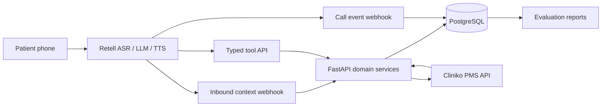

# Multilingual clinic voice receptionist

A reliable English/Hindi appointment receptionist built for Retell, backed by FastAPI and
PostgreSQL, with live Cliniko availability and appointment write-back. The agent supports booking,
rescheduling, cancellation, shared-phone identity, returning callers, missed outbound callbacks,
dropped-call recovery, cross-branch earliest-slot search, policy-based fees, and human follow-up.

The repository defaults to a deterministic mock PMS so a clean clone can be evaluated without paid
credentials. Setting `PMS_PROVIDER=cliniko` activates the real Cliniko adapter.

> **Current data status:** the seed names and locations are development fixtures. Before final
> submission, replace their public-facing fields with doctors, departments, branches, opening hours,
> and policies sourced from a real clinic. A Cliniko account is a real PMS, but dummy data inside it
> does not by itself satisfy the assignment's “real clinic, sourced not invented” requirement.

## Why Retell

Retell was selected over Bolna for this clinic because it offers granular English/Hindi multilingual
configuration, inbound webhook enrichment, custom HTTP functions, dynamic variables, call-level
latency data, interruption controls, and built-in batch simulation. Its initial free credit is used
only for voice-dependent validation; deterministic scheduling tests run locally for free.

The Retell platform remains the voice transport/orchestrator. It does not decide whether a slot is
valid. All identity, conflict, branch, timezone, buffer, fee, idempotency, and recovery rules are
enforced by this backend.

## Architecture



### Authority boundaries

- **Retell/LLM:** understands natural English, Hindi, and code-switching; extracts structured intent
  and constraints; speaks naturally.
- **Backend:** owns patient disambiguation, time interpretation inputs, live searches, offer expiry,
  booking lifecycle, fees, recovery, idempotency, and follow-up.
- **PostgreSQL:** owns transactional reservations, call state, audit logs, idempotency records, and a
  write-time practitioner overlap exclusion constraint.
- **Cliniko:** supplies live bookable times and receives patient/appointment writes.

## Reliability design

### No anonymous booking

A recognized phone number supplies context but is not treated as identity. The booking endpoint
requires a matched patient ID and a full name containing at least two name components. The name must
match the patient record. If several patients share a phone, the caller must state a full name before
one is selected.

Caller identity and appointment-patient identity are tracked separately. For a booking made on
behalf of someone else, the actual patient is matched or created under the shared phone before any
write. The booking endpoint rejects `booking_for=other` when the caller identity has accidentally
been reused as the appointment patient.

### No stale availability

Every search creates a new `availability_searches` record and short-lived `offered_slots`. The agent
can book only with an `offer_id`; it cannot submit a hallucinated time. Booking re-runs the relevant
Cliniko availability query before writing. Any change to date, time, weekday, doctor, specialty, or
branch requires a fresh search.

An omitted `date_from` means today's date in the configured clinic timezone. Retell therefore omits
the date for "earliest" or "from now" instead of calculating a UTC date that may already be yesterday
in the clinic.

### Confirmation gate

For live calls carrying a `call_id`, selecting an offer is insufficient authorization to book. After
speaking the exact date, time, doctor, and branch, the agent must wait for a new explicit caller
approval and checkpoint `stage=booking_confirmed` with the same offer ID. The booking endpoint rejects
missing, stale, or mismatched confirmation checkpoints with `EXPLICIT_CONFIRMATION_REQUIRED`.

### Cross-branch earliest search

The backend enumerates every eligible `(branch, practitioner, appointment type)` combination, calls
live availability, combines all results, then performs one global timestamp sort. A partial Cliniko
failure fails the search rather than falsely claiming a later slot is earliest.

### Double-booking protection

Booking uses four layers:

1. Short-lived backend offer.
2. Second live PMS availability check.
3. PostgreSQL reservation and pending appointment write.
4. PostgreSQL `tstzrange` exclusion constraint plus Cliniko's post-write conflict endpoint.

If Cliniko reports a conflict after creation, the new PMS appointment is cancelled and the agent is
given fresh alternatives. SQLite is supported only for convenient development; PostgreSQL is the
required deployment database for exclusion-constraint protection.

### PMS failure behavior

Cliniko timeouts or 5xx responses never produce a false “confirmed” response. The local appointment
remains `pending_sync`, an outbox/manual-review record and urgent staff follow-up are created, and the
agent is instructed to say that the slot is reserved but clinic-system confirmation is pending.
Every write carries a stable idempotency key. Reusing a key for a different request returns a conflict.

### Dropped calls and callbacks

Meaningful stages are checkpointed in PostgreSQL. Retell's inbound webhook looks up a recent
incomplete session and pending missed-outbound intent. The prompt acknowledges a disconnect or
callback and resumes without re-asking captured fields.

### Timezone and fees

All storage timestamps are UTC and all interpretation/presentation uses the clinic's IANA timezone,
default `Asia/Kolkata`. Same-day lead time is enforced after conversion. Cancellation/rescheduling
fees are returned only inside the configured policy window and require explicit caller acceptance.

## Repository layout

```text
src/clinic_voice/
  api.py                 Retell tool and webhook routes
  models.py              PostgreSQL/SQLAlchemy data model
  services/              Identity, availability, lifecycle, recovery
  pms/                   Mock and Cliniko adapters
  seed.py                Deterministic two-branch test data
  sync_cliniko.py        Imports the live Cliniko scheduling catalogue and relationships
  eval_harness.py        Per-language and component-latency reports
retell/
  agent_prompt.md        Production behavior and multilingual rules
  tools.json             Custom function schemas
  test_cases.json        Multi-turn Retell simulations
sql/postgres_constraints.sql
tests/
```

## Quick start: local mock mode

Requirements: Python 3.11+ and PostgreSQL 16, or Docker.

```bash
cp .env.example .env
python -m venv .venv
# Windows: .venv\Scripts\activate
# macOS/Linux: source .venv/bin/activate
python -m pip install -e ".[dev]"
docker compose up -d db
clinic-seed --reset
uvicorn clinic_voice.main:app --reload
```

The Compose database listens on host port `5433` to avoid colliding with an existing PostgreSQL
installation on the conventional `5432` port. Containers still reach it internally as `db:5432`.

Open `http://localhost:8000/docs` and check `GET /health`.

Full container startup:

```bash
cp .env.example .env
docker compose up --build
docker compose exec api clinic-seed --reset
```

## Cliniko setup

1. Create the intended Cliniko businesses. Their names become the local branch names automatically.
2. Create three users/practitioners. Cliniko practitioners are associated with user accounts and are
   created in the UI.
3. Create the intended appointment types.
4. Associate the practitioners with their businesses and appointment types.
5. Enable both businesses, all doctors, and all appointment types for online bookings. Cliniko's
   available-time endpoint omits resources that are not online-booking enabled.
6. Set timezone, booking horizon, lead time, and daily availability.
7. Generate a Cliniko API key under **My Info**.
8. Set `.env` to `PMS_PROVIDER=cliniko`, add the key and the correct shard base URL.
9. Run `clinic-sync` to import businesses, practitioners, appointment types, and their relationships.
   Use `--include-patients` only when you deliberately want to copy patient and appointment metadata
   from Cliniko into the local database; it is not needed for a clean assignment test.

Cliniko does not provide a specialty catalogue for these generic appointment types. Set
`CLINIKO_DEFAULT_SPECIALTY` to the clinic-level specialty used for natural-language matching.

Never commit the Cliniko key. It grants access to sensitive PMS data.

### Mock-only development fixture

| Code | Name | Specialty | Locations |
|---|---|---|---|
| `DR_GENERAL_1` | Dr Aarav Mehta | General Medicine | Central, North |
| `DR_GENERAL_2` | Dr Nisha Verma | General Medicine | Central, North |
| `DR_DERM_1` | DR KAVYA IYER | Dermatology | North |

| Code | Patient duration | Calendar duration | Demo price |
|---|---:|---:|---:|
| `GENERAL_NEW` | 30 min | 45 min | ₹800 |
| `GENERAL_FOLLOWUP` | 20 min | 30 min | ₹500 |
| `DERM_CONSULT` | 30 min | 45 min | ₹1,000 |

The longer calendar duration includes required between-patient buffer time. The patient hears the
patient-facing duration.

## Retell setup

1. Create a Conversation Flow Agent.
2. Select only English (India/US as appropriate) and Hindi (India), not broad legacy multilingual.
3. Select a voice that supports both selected languages.
4. Paste `retell/agent_prompt.md` as the global prompt.
5. Use one **Book Appointment** subagent for catalogue lookup, availability, slot selection, the
   single confirmation question, the `booking_confirmed` checkpoint, and `book_appointment`. Paste
   `retell/booking_subagent_prompt.md` into that node and attach `get_clinic_catalog`,
   `search_availability`, `checkpoint`, and `book_appointment`. Do not add separate Confirm Booking
   or Execute Booking nodes: a prompt-based edge can transition on a caller's "yes" before the
   checkpoint tool result exists, which causes the backend guard to send the flow back and repeat
   confirmation.
6. Add each custom function from `retell/tools.json`, replacing variables with the public HTTPS
   backend URL and webhook secret. Enable Retell's **Payload: args only** option for every custom
   function so the JSON body matches the documented endpoint schema.
7. Configure the inbound-number webhook as `/webhooks/retell/inbound`.
8. Configure call event webhooks as `/webhooks/retell/events`.
9. Add `clinic_name`, `clinic_timezone`, and inbound phone/call IDs as dynamic variables.
10. Tune interruption sensitivity using real phone audio, not text simulation alone.
11. Import/recreate the scenarios in `retell/test_cases.json` as batch simulations.

For the configured development agent, the guarded updater merges an existing three-node draft and
verifies the returned graph before publishing. Updating the draft does not place a call or consume
voice minutes:

```powershell
.\.venv\Scripts\python.exe scripts\update_retell_booking_flow.py
.\.venv\Scripts\python.exe scripts\update_retell_booking_flow.py --publish
```

The first command only updates and verifies the draft. Run the second command only after reviewing
that draft. Retell keeps earlier published agent versions available for rollback.

A dedicated test number is recommended. Keep the web-call interface as a fallback because number
rental and telephony may not be included in free credits. Do not place outbound calls to numbers you
do not control.

The inbound webhook belongs to the purchased/imported phone-number configuration and is invoked
before an inbound call is connected. The event webhook belongs at agent level (or account level, but
not both) and should subscribe to `call_ended` and `call_analyzed`. Retell signs these webhook bodies
with `X-Retell-Signature`; the backend verifies the raw request using `RETELL_API_KEY` and a five-minute
replay window. Use a Retell API key marked for webhook verification. Custom tools are different: they
continue to authenticate with the generated `X-Webhook-Secret` header.

## API tools

| Endpoint | Purpose |
|---|---|
| `POST /v1/tools/get-caller-context` | Returning/shared-phone/drop/callback lookup |
| `POST /v1/tools/identify-patient` | Full-name match or safe new-patient creation |
| `POST /v1/tools/get-clinic-catalog` | Active Cliniko specialties, doctors, services, branches, and relationships |
| `POST /v1/tools/search-availability` | Fresh cross-branch live search |
| `POST /v1/tools/book-appointment` | Recheck, reserve, write, conflict-check |
| `POST /v1/tools/list-appointments` | Select an existing appointment |
| `POST /v1/tools/reschedule-appointment` | Policy-aware move |
| `POST /v1/tools/cancel-appointment` | Policy-aware cancellation |
| `POST /v1/tools/checkpoint` | Persist call progress |
| `POST /v1/tools/create-followup` | Log staff callback or clinical concern |

Production tool calls authenticate with `X-Webhook-Secret`; Retell webhooks may alternatively use a
Bearer value matching `RETELL_API_KEY`. PII fields are redacted from tool audit request bodies.

### Early catalogue validation

The booking flow calls `get_clinic_catalog` before asking for dates or times. This data comes from the
latest catalogue synchronized from Cliniko, so unsupported requests are rejected without wasting a
full scheduling conversation. For example, if ENT is absent from `specialties`, the agent states that
the clinic does not offer ENT and offers only the supported specialties or a staff callback.

`search_availability` also enforces the rule server-side and returns one of these codes:

- `UNSUPPORTED_SPECIALTY`, `UNKNOWN_PRACTITIONER`, `UNKNOWN_APPOINTMENT_TYPE`, or `UNKNOWN_BRANCH`:
  the requested item is not in the active catalogue.
- `INELIGIBLE_COMBINATION`: the items exist, but the doctor/service/branch relationship is invalid.
- `NO_AVAILABLE_SLOTS`: the request is valid, but no live time matches the scheduling constraints.
- `OK`: live offers are present.

This is intentionally not a hardcoded doctor list in Retell. After changing Cliniko practitioners,
appointment types, or branches, run `clinic-sync`; a new deployment with an empty database performs
the initial sync automatically.

## Tests and evaluation

Run deterministic backend tests:

```bash
pytest
```

They cover shared phones, returning callers, missed callbacks, dropped-call state, exact date/time
constraints, branch-specific specialties, global earliest search, full-name enforcement, slot races,
branch consistency, idempotency, buffer-aware availability, policy fees, and PMS failure behavior.

Validate the multi-turn scenario catalog:

```bash
clinic-eval --validate-scenarios
```

Validation fails if a scenario is only a single prompt, has fewer than two scripted caller turns,
lacks expected agent behavior, uses an unsupported language label, or duplicates an ID. The catalog
explicitly scripts successive caller turns, corrections, confirmations, and expected tool behavior.

Export the selected measured Retell calls and generate the report from their normalized results:

```powershell
.\.venv\Scripts\python.exe scripts\export_retell_evaluation.py
& .\.venv\Scripts\clinic-eval.exe --validate-scenarios
& .\.venv\Scripts\clinic-eval.exe evals\retell_calls.json --output eval-results
```

The committed `evals/retell_calls.json` contains the normalized measured dataset, so report
generation works without Retell credentials. The exporter is only needed to refresh the dataset
from Retell. A normalized result records `language`, `intent`, `task_completed`,
`booking_confirmed`, `completion_turn`, full alternating turns, correctness annotations, and scalar
or per-turn component latency samples.

### Measured Retell results

The submission dataset contains six scenarios backed by seven Retell audio calls. The interrupted
pair is evaluated as one recovery scenario because the second call completes and verifies the state
written by the first.

| Scenario | Language | Retell call ID(s) |
|---|---|---|
| No available slots | English | `call_ec292b30afbcfe2a572187f4334` |
| Rescheduled successfully | Code-switch | `call_f17c9104ab8f577d402ba295f68` |
| Appointment cancelled successfully | Hindi | `call_b0b597d159e34c58fcb91bd60b0` |
| Interrupted, then completed on callback | English | `call_e32f1733953995916548677953b`, `call_bb0f1588bfad7eaa296de0862c8` |
| Unsupported service request | English | `call_42adbb2a06f120e87e1dc16c3df` |
| Hindi appointment booking | Hindi | `call_7ba6c01d8633f01789df675da73` |

| Language | Scenarios | Completion | Confirmed booking | Mean caller turns/completion | Redundant questions/call |
|---|---:|---:|---:|---:|---:|
| English | 3 | 100% | 50% | 11.67 | 0 |
| Hindi | 2 | 100% | 100% | 10.00 | 0 |
| Code-switch | 1 | 100% | n/a | 7.00 | 0 |

English confirmed-booking rate is 50% because one of its two booking intents correctly concluded
that no slot was available; the other English booking completed successfully. It is not a failed
write. Reschedule and cancellation scenarios are excluded from the confirmed-booking denominator.

| Language | ASR p50/p95 ms | LLM p50/p95 ms | TTS p50/p95 ms | End-to-end p50/p95 ms |
|---|---:|---:|---:|---:|
| English | 204 / 645 | 782 / 2,287 | 201 / 296 | 1,808 / 3,542 |
| Hindi | 184 / 990 | 934 / 2,264 | 184 / 237 | 1,725 / 3,328 |
| Code-switch | 39 / 202 | 792 / 2,502 | 173 / 225 | 1,255 / 2,847 |

Retell did not expose separate tool or network samples for these exports, so those fields remain
`null`; they are not inferred from end-to-end latency. Full metrics and limitations are in
[the complete generated report](eval-results/report.md).

Every outcome, efficiency, correctness, and latency table keeps English, Hindi, and code-switch
cohorts separate. No blended language score is used. The report includes:

- Task completion rate
- Mean and p95 caller turns to completion
- Confirmed-booking rate and mean turns to a confirmed booking
- Redundant questions per call and calls containing at least one redundant question
- Fresh-search compliance
- Full-name identity compliance
- Spoken/backend branch match
- Dropped-call recovery
- Per-language ASR, LLM, TTS, tool, network, and end-to-end p50/p95 latency

These measured runs exercise Retell ASR and TTS with real audio. The small sample still cannot cover
the full range of accents, background noise, devices, carrier conditions, or interruption patterns;
larger production monitoring remains necessary.

### Why these evaluation dimensions

- **Completion and confirmed-booking rate** distinguish a pleasant conversation from a completed
  write. Confirmation requires the backend result, not merely a selected slot.
- **Turns to completion** measure front-desk efficiency. Extra turns usually indicate unnecessary
  clarification, forgotten state, or poor constraint extraction.
- **Redundant questions** measure whether supplied information was retained. Exact repeats are
  detected automatically; `provided_fields` and `asked_for` annotations catch semantic re-asks.
- **Fresh-search, identity, and branch correctness** target stale availability, anonymous or
  wrong-patient writes, and mismatches between what was spoken and what was booked.
- **Component latency** separates speech recognition, reasoning, speech generation, tool/PMS work,
  transport, and caller-observed end-to-end delay. Components can overlap and must not be summed.
- **Language separation** exposes failures that a larger English sample would hide. Code-switching
  remains its own cohort.

### Where the harness gives false confidence

Scripted callers are more cooperative than real callers. Text runs do not validate audio quality,
accents, names, noise, interruptions, or carrier behavior. Exact-repeat detection misses
unannotated paraphrases, small cohorts have wide uncertainty, mock success does not validate Cliniko
permissions, and a warm endpoint understates free-tier cold starts. Retell component timings depend
on available instrumentation and can overlap. The report repeats these limitations beside results.

### Clean-clone rerun

```bash
git clone <repository-url>
cd <repository-directory>
cp .env.example .env
python -m venv .venv
# Windows: .venv\Scripts\activate
# macOS/Linux: source .venv/bin/activate
python -m pip install -e ".[dev]"
docker compose up -d db
clinic-seed --reset
pytest
clinic-eval --validate-scenarios
clinic-eval evals/retell_calls.json --output eval-results
uvicorn clinic_voice.main:app --host 0.0.0.0 --port 8000
```

This credential-free path exercises deterministic multi-branch mock mode. Live integration reruns
add independently owned Retell and Cliniko accounts and secrets; evaluators should never need
committed credentials.

## Render deployment

`render.yaml` provisions a free Python web service and a free PostgreSQL database. Because Render's
free tier does not support pre-deploy commands, its start command runs `clinic-bootstrap` before
Uvicorn. The bootstrap creates the schema and synchronizes Cliniko scheduling metadata only when the
persistent PostgreSQL catalogue is empty; ordinary free-tier wake-ups skip the external sync.
Render's provider-supplied `postgresql://` connection string is normalized automatically to
SQLAlchemy's `postgresql+psycopg://` URL so the installed Psycopg 3 driver is used.

1. Push the repository to GitHub without `.env`.
2. In Render, choose **New → Blueprint** and connect the repository.
3. Supply `CLINIKO_API_KEY`, `CLINIKO_USER_AGENT`, `RETELL_API_KEY`, and `RETELL_AGENT_ID` when
   prompted. They are not stored in `render.yaml`.
4. Wait for `/health` to report `status=ok`, `database=postgresql`, and `pms_provider=cliniko`.
5. Copy Render's generated `WEBHOOK_SECRET` into the `X-Webhook-Secret` header of every Retell tool.
6. Replace Retell's backend URL with `https://<service>.onrender.com`; point Retell event endpoints
   to `/webhooks/retell/inbound` and `/webhooks/retell/events` on the same host.

Free Render services sleep after inactivity and can take about a minute to wake, so warm `/health`
before an assignment call. Free Render PostgreSQL expires after 30 days and has no backups. This is
appropriate for a time-limited evaluation, not production.

## Phone-number and independent telephony testing

The backend, Retell web calls, and simulations work without purchasing a number. Public telephone
calls have additional requirements:

- **Inbound:** attach a Retell-purchased number or a supported imported/SIP-routed number to the
  agent.
- **Outbound:** supply an authorized Retell `from_number`, call only numbers the tester controls,
  and maintain sufficient Retell credit.
- **Independent clone:** anyone can rerun backend tests and the scripted harness in mock mode. Real
  phone calls require their own Retell account, agent, number or SIP route, credit, Cliniko trial,
  and secrets. A repository clone cannot grant access to your external accounts.

You do not need to purchase a number for web-call, simulation, backend, or deployment testing. You
do need one before claiming that public inbound and outbound PSTN calling is live.

## Free-version strategy

- Run all database, scheduling, race, policy, and failure tests locally.
- Use Retell text/batch simulation for prompt regressions.
- Spend voice credits only on Hindi/English ASR, code-switching, names, interruptions, noise, and
  component latency.
- Use small live test sets repeatedly rather than long exploratory calls.
- Do not depend on a paid cache, queue, vector database, or Kubernetes deployment.

## Known limitations

- Cliniko does not expose practitioner creation in the public API; practitioners require UI setup.
- The current seed clinic is not yet replaced with sourced real-clinic public data.
- Cliniko and PostgreSQL cannot share one distributed transaction. The reservation/outbox/conflict
  workflow is an explicit saga and reports pending confirmation honestly.
- Automatic Hindi quality grading remains imperfect and needs bilingual human review.
- Emergency guidance is deliberately conservative; the agent logs follow-up and does not diagnose.
- Phone-number availability and pricing depend on the Retell account and destination country.

## Security

- `.env` is ignored by Git.
- Use HTTPS for all Retell and Cliniko traffic.
- Rotate exposed webhook/API secrets immediately.
- Do not use real patient data in this assignment account.
- Configure minimum Retell recording/transcript retention appropriate for evaluation.
- Protect the Cliniko API key as a password.
